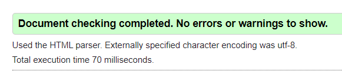
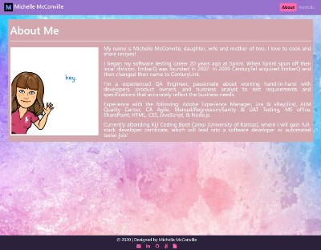
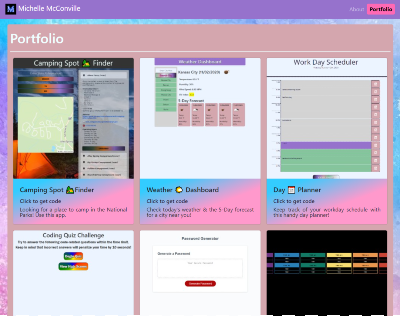

# [**08-updated-portfolio**](https://michellemcconville.github.io/08-updated-portfolio/) 🔗

## Description

For this project the customer request we update our previous ***`Portfolio`*** page with the following:

* Updated Portfolio featuring project 1 & 2 exemplary homework assignments
* Updated GitHub profile w/ pinned repositories featuring project 1 & 2 exemplary assignments
* Updated Resume
* Updated LinkedIn profile

---

## User Story

```.
* WHEN a user wants to find more information about me
* THEN a user can explore my Portfolio website which contains:
  1. A short bio page
  2. Completed projects page
  3. Links in the footer for contacting me
```

---

## Sources Referenced

[My Github](https://github.com/MichelleMcConville) **`|`**
[w3schools](https://www.w3schools.com) **`|`**
[google](https://www.google.com/)

---

## Accessibility Standards Validation

| Successfully ran code thru [**W3C**](https://validator.w3.org/) validator |
|---------------------------------------------------------------------------|
|                         |

---

## Screenshots

| ***About Me***                           | ***Portfolio***                                |
| :--------------------------------------: | :--------------------------------------------: |
|  |  |

---

## Future Development

* Continue to refine styling
* Update using React.js

---

## Contributors

* Michelle McConville
